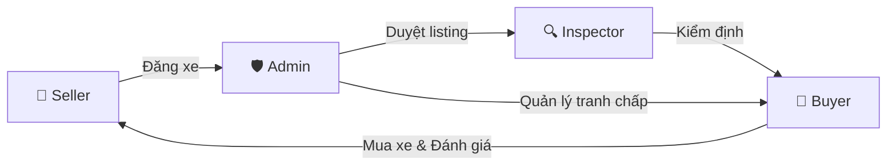
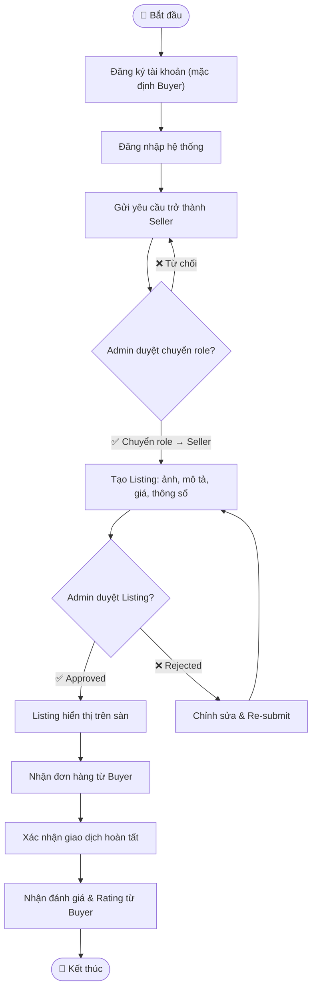
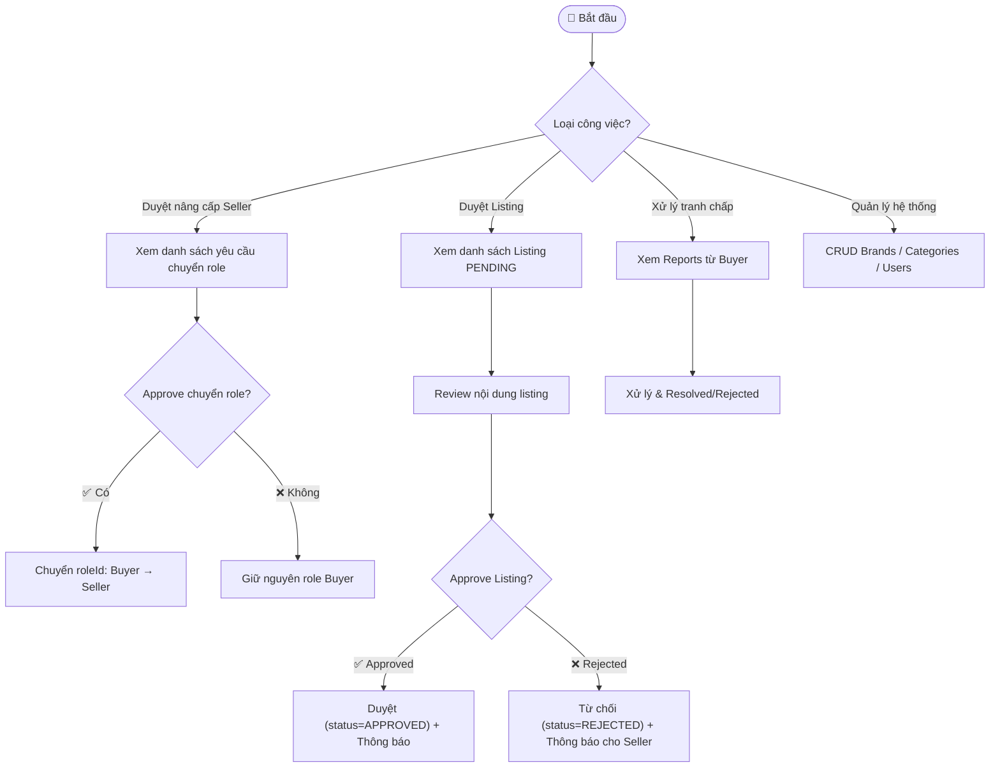
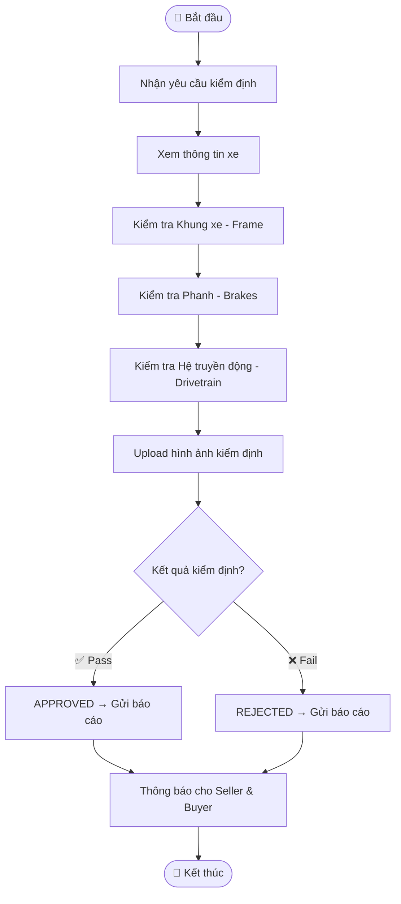
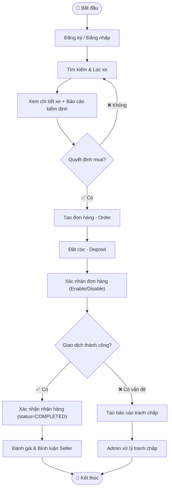
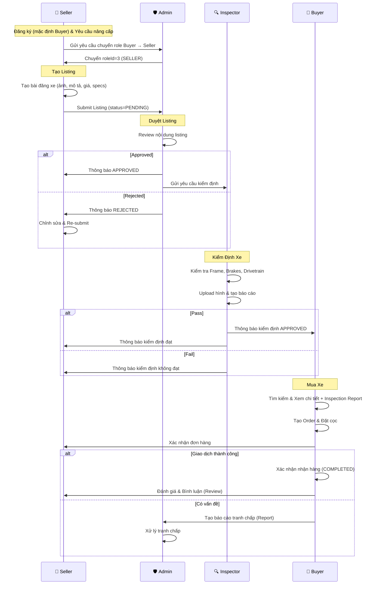

# CycleTrust – Kế Hoạch Luồng Hoạt Động Theo Vai Trò

> Tài liệu phân tích Activity Diagram và mô tả toàn bộ luồng hoạt động cho 4 vai trò: **Admin**, **Seller**, **Buyer**, **Inspector**.

---

## Tổng Quan Hệ Thống

CycleTrust là nền tảng mua bán xe đạp đã qua sử dụng với cơ chế **kiểm định chất lượng** (Inspection) trước khi cho phép giao dịch. Hệ thống gồm 4 vai trò chính tương tác với nhau theo luồng sau:

---

## 1. 🏪 Seller (Người Bán)

### 1.1. Đăng Ký & Nâng Cấp Role

> ⚠️ Mọi người dùng mới đều đăng ký với **role mặc định là Buyer** (roleId=2). Muốn trở thành Seller thì phải **yêu cầu Admin chuyển role** từ Buyer → Seller.

| Bước | Hành động | API / Entity | Trạng thái |
|------|-----------|-------------|------------|
| S1.1 | Đăng ký tài khoản (mặc định role = **Buyer**) | `POST /api/users` (roleId=2) | `UserStatus.ACTIVE` |
| S1.2 | Đăng nhập hệ thống | `POST /api/auth/login` | Nhận JWT Token |
| S1.3 | Gửi yêu cầu trở thành Seller | UI / Request | Chờ Admin duyệt |
| S1.4 | Admin chuyển role từ Buyer → Seller | `PUT /api/users/{id}` (roleId=3) | Role = `SELLER` |

### 1.2. Tạo Listing (Đăng Bán Xe)

| Bước | Hành động | API / Entity | Trạng thái |
|------|-----------|-------------|------------|
| S2.1 | Tạo bài đăng xe mới (title, description, price, brand, category, frameSize, condition) | `POST /api/bikes` | `BikeStatus.PENDING` |
| S2.2 | Upload hình ảnh xe | `POST /api/bikeimages` | Gắn ảnh vào Bike |
| S2.3 | Chờ Admin duyệt listing | — | Chờ `APPROVED` hoặc `REJECTED` |

### 1.3. Xử Lý Khi Bị Từ Chối

| Bước | Hành động | API / Entity | Trạng thái |
|------|-----------|-------------|------------|
| S3.1 | Nhận thông báo listing bị từ chối | Notification | `BikeStatus.REJECTED` |
| S3.2 | Chỉnh sửa thông tin xe | `PUT /api/bikes/{id}` | Cập nhật thông tin |
| S3.3 | Re-submit listing (đặt lại status PENDING) | `PUT /api/bikes/{id}` (status=PENDING) | `BikeStatus.PENDING` |

### 1.4. Sau Khi Listing Được Duyệt

| Bước | Hành động | API / Entity | Trạng thái |
|------|-----------|-------------|------------|
| S4.1 | Listing hiển thị cho Buyer | `BikeStatus.APPROVED` | Xe lên sàn |
| S4.2 | Nhận đơn hàng từ Buyer | `Orders` | `OrderStatus.PENDING` |
| S4.3 | Xác nhận hoàn tất giao dịch | `PUT /api/orders/{id}` (status=COMPLETED) | `OrderStatus.COMPLETED` |
| S4.4 | Nhận đánh giá & bình luận từ Buyer | `Reviews` | Rating 1-5 ⭐ |

### Sơ đồ luồng Seller

---

## 2. 🛡️ Admin (Quản Trị Viên)

### 2.1. Duyệt Yêu Cầu Nâng Cấp Role → Seller

> ⚠️ User mặc định là Buyer. Khi muốn trở thành Seller, Admin sẽ **chuyển roleId** từ 2 (Buyer) → 3 (Seller).

| Bước | Hành động | API / Entity | Trạng thái |
|------|-----------|-------------|------------|
| A1.1 | Xem danh sách yêu cầu nâng cấp Seller | `GET /api/users` (filter pending requests) | — |
| A1.2 | **Duyệt** → Chuyển role từ Buyer sang Seller | `PUT /api/users/{id}` (roleId=3) | Role = `SELLER` |
| A1.3 | **Từ chối** → Giữ nguyên role Buyer | — | Role = `BUYER` |

### 2.2. Duyệt Listing (Bài Đăng Xe)

| Bước | Hành động | API / Entity | Trạng thái |
|------|-----------|-------------|------------|
| A2.1 | Xem danh sách listing chờ duyệt | `GET /api/bikes` (filter status=PENDING) | — |
| A2.2 | Review nội dung listing (ảnh, mô tả, giá, thông số) | `GET /api/bikes/{id}` | — |
| A2.3a | **Duyệt** listing | `PUT /api/bikes/{id}` (status=APPROVED) | `BikeStatus.APPROVED` |
| A2.3b | **Từ chối** listing | `PUT /api/bikes/{id}` (status=REJECTED) | `BikeStatus.REJECTED` |
| A2.4 | Gửi thông báo cho Seller (duyệt/từ chối) | Notification | — |

### 2.3. Quản Lý Tranh Chấp & Báo Cáo

| Bước | Hành động | API / Entity | Trạng thái |
|------|-----------|-------------|------------|
| A3.1 | Xem danh sách báo cáo từ Buyer | `GET /api/reports` (filter status=PENDING) | — |
| A3.2 | Xử lý tranh chấp | `PUT /api/reports/{id}` (status=RESOLVED/REJECTED) | `ReportStatus.RESOLVED` / `REJECTED` |
| A3.3 | Ban user vi phạm (nếu cần) | `PUT /api/users/{id}` (status=BANNED) | `UserStatus.BANNED` |

### 2.4. Quản Lý Dữ Liệu Nền Tảng

| Bước | Hành động | API / Entity |
|------|-----------|-------------|
| A4.1 | CRUD Brands (thương hiệu xe) | `/api/brands` |
| A4.2 | CRUD Categories (danh mục xe) | `/api/categories` |
| A4.3 | CRUD Roles (vai trò) | `/api/roles` |
| A4.4 | Quản lý tất cả Users | `/api/users` |

### Sơ đồ luồng Admin

---

## 3. 🔍 Inspector (Kiểm Định Viên)

### 3.1. Nhận Yêu Cầu Kiểm Định

| Bước | Hành động | API / Entity | Trạng thái |
|------|-----------|-------------|------------|
| I1.1 | Nhận thông báo yêu cầu kiểm định xe | Notification / Assignment | — |
| I1.2 | Xem thông tin xe cần kiểm định | `GET /api/bikes/{id}` | — |

### 3.2. Thực Hiện Kiểm Định

| Bước | Hành động | API / Entity | Chi tiết |
|------|-----------|-------------|----------|
| I2.1 | Kiểm tra tình trạng **Khung xe** (Frame) | `frameCondition` | Trầy xước, méo, gãy, ... |
| I2.2 | Kiểm tra tình trạng **Phanh** (Brakes) | `brakeCondition` | Phanh đĩa, phanh v, độ mòn... |
| I2.3 | Kiểm tra tình trạng **Hệ truyền động** (Drivetrain) | `drivetrainCondition` | Sên, líp, đĩa, ... |
| I2.4 | Viết nhận xét tổng quan | `overallComment` | — |

### 3.3. Upload Báo Cáo & Kết Luận

| Bước | Hành động | API / Entity | Trạng thái |
|------|-----------|-------------|------------|
| I3.1 | Upload hình ảnh/file báo cáo kiểm định | `POST /api/inspectionreports` (reportFile) | `InspectionStatus.PENDING` |
| I3.2 | Đánh giá **Đạt / Không đạt** | — | Quyết định nội bộ |
| I3.3a | **Đạt** → Cập nhật status APPROVED | `PUT /api/inspectionreports/{id}` (status=APPROVED) | `InspectionStatus.APPROVED` |
| I3.3b | **Không đạt** → Cập nhật status REJECTED | `PUT /api/inspectionreports/{id}` (status=REJECTED) | `InspectionStatus.REJECTED` |
| I3.4 | Thông báo kết quả cho Seller & Buyer | Notification | — |

### Sơ đồ luồng Inspector

---

## 4. 🛒 Buyer (Người Mua)

### 4.1. Đăng Ký & Đăng Nhập

| Bước | Hành động | API / Entity | Trạng thái |
|------|-----------|-------------|------------|
| B1.1 | Đăng ký tài khoản (mặc định role = **Buyer**) | `POST /api/users` (roleId=2) | `UserStatus.ACTIVE` |
| B1.2 | Đăng nhập hệ thống | `POST /api/auth/login` | Nhận JWT Token |

### 4.2. Tìm Kiếm & Duyệt Xe

| Bước | Hành động | API / Entity | Bộ lọc |
|------|-----------|-------------|--------|
| B2.1 | Duyệt danh sách xe (chỉ xe đã APPROVED) | `GET /api/bikes` (filter status=APPROVED) | — |
| B2.2 | Tìm kiếm & lọc theo tiêu chí | `GET /api/bikes` + query params | Type, Brand, Price, Size |
| B2.3 | Xem chi tiết xe + Ảnh | `GET /api/bikes/{id}` | Bao gồm `imageUrls` |
| B2.4 | Xem báo cáo kiểm định | `GET /api/inspectionreports` (filter bikeId) | `InspectionStatus.APPROVED` |
| B2.5 | Nhận thông báo kết quả kiểm định | Notification | — |

### 4.3. Thêm Wishlist

| Bước | Hành động | API / Entity |
|------|-----------|-------------|
| B3.1 | Thêm xe vào Wishlist | `POST /api/wishlists` |
| B3.2 | Xem Wishlist | `GET /api/wishlists` (filter buyerId) |
| B3.3 | Xóa khỏi Wishlist | `DELETE /api/wishlists/{id}` |

### 4.4. Đặt Hàng & Thanh Toán

| Bước | Hành động | API / Entity | Trạng thái |
|------|-----------|-------------|------------|
| B4.1 | Quyết định mua xe | UI Decision | — |
| B4.2 | Tạo đơn hàng (Add to Order Bill) | `POST /api/orders` | `OrderStatus.PENDING` |
| B4.3 | Đặt cọc (Deposit) | `PUT /api/orders/{id}` (status=DEPOSITED) | `OrderStatus.DEPOSITED` |
| B4.4 | Xác nhận / Hủy đơn hàng | `PUT /api/orders/{id}` | `COMPLETED` / `CANCELLED` |

### 4.5. Sau Giao Dịch

| Bước | Hành động | API / Entity | Trạng thái |
|------|-----------|-------------|------------|
| B5.1 | **Giao dịch thành công** → Xác nhận nhận hàng | `PUT /api/orders/{id}` (status=COMPLETED) | Bike → `SOLD` |
| B5.2 | Đánh giá & Bình luận Seller | `POST /api/reviews` | Rating 1-5 ⭐ |
| B5.3 | **Giao dịch có vấn đề** → Tạo báo cáo tranh chấp | `POST /api/reports` | `ReportStatus.PENDING` |
| B5.4 | Chờ Admin xử lý tranh chấp | — | `ReportStatus.RESOLVED` / `REJECTED` |

### Sơ đồ luồng Buyer

---

## 5. Luồng Tổng Hợp End-to-End

Luồng hoàn chỉnh từ khi Seller đăng bán đến khi Buyer hoàn tất giao dịch:

---

## 6. Bảng Tổng Hợp Trạng Thái

### Bike Status Flow
| Trạng thái | Mô tả | Ai chuyển? |
|------------|--------|------------|
| `PENDING` | Mới tạo, chờ Admin duyệt | Seller (tự động) |
| `APPROVED` | Đã duyệt, hiển thị cho Buyer | Admin |
| `REJECTED` | Bị từ chối, Seller cần sửa | Admin |
| `SOLD` | Đã bán thành công | Hệ thống (khi Order COMPLETED) |

### Order Status Flow
| Trạng thái | Mô tả | Ai chuyển? |
|------------|--------|------------|
| `PENDING` | Đơn hàng mới tạo | Buyer (tự động) |
| `DEPOSITED` | Đã đặt cọc | Buyer |
| `COMPLETED` | Giao dịch hoàn tất | Buyer xác nhận |
| `CANCELLED` | Đơn hàng bị hủy | Buyer / Admin |

### Inspection Status Flow
| Trạng thái | Mô tả | Ai chuyển? |
|------------|--------|------------|
| `PENDING` | Yêu cầu kiểm định mới | Hệ thống (tự động) |
| `APPROVED` | Xe đạt kiểm định | Inspector |
| `REJECTED` | Xe không đạt kiểm định | Inspector |

### Report Status Flow
| Trạng thái | Mô tả | Ai chuyển? |
|------------|--------|------------|
| `PENDING` | Báo cáo mới từ Buyer | Buyer (tự động) |
| `RESOLVED` | Đã xử lý | Admin |
| `REJECTED` | Từ chối báo cáo | Admin |

---

## 7. Ma Trận Phân Quyền API

| API Endpoint | Admin | Seller | Buyer | Inspector |
|-------------|:-----:|:------:|:-----:|:---------:|
| `POST /api/users` (đăng ký, mặc định Buyer) | — | — | ✅ | — |
| `PUT /api/users/{id}` (chuyển role / ban) | ✅ | — | — | — |
| `POST /api/bikes` (tạo listing) | — | ✅ | — | — |
| `PUT /api/bikes/{id}` (duyệt) | ✅ | — | — | — |
| `PUT /api/bikes/{id}` (chỉnh sửa) | — | ✅ | — | — |
| `GET /api/bikes` (xem danh sách) | ✅ | ✅ | ✅ | ✅ |
| `POST /api/inspectionreports` | — | — | — | ✅ |
| `PUT /api/inspectionreports/{id}` | — | — | — | ✅ |
| `GET /api/inspectionreports` | ✅ | ✅ | ✅ | ✅ |
| `POST /api/orders` | — | — | ✅ | — |
| `PUT /api/orders/{id}` | ✅ | ✅ | ✅ | — |
| `POST /api/reviews` | — | — | ✅ | — |
| `POST /api/reports` (tranh chấp) | — | — | ✅ | — |
| `PUT /api/reports/{id}` (xử lý) | ✅ | — | — | — |
| `POST /api/wishlists` | — | — | ✅ | — |
| `POST /api/messages` | ✅ | ✅ | ✅ | ✅ |
| CRUD Brands / Categories | ✅ | — | — | — |
